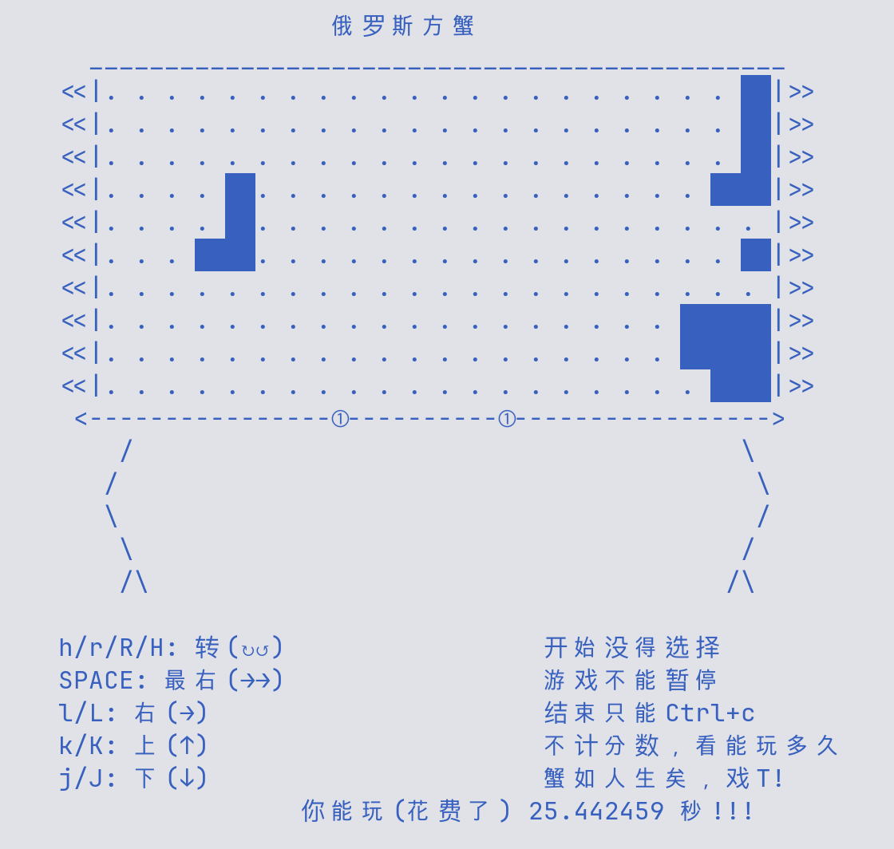

# Crabtris

俄罗斯方蟹 = Crab（蟹）+ Tetris（俄罗斯方块）

## 运行

```bash
gcc -o crabtris crabtris.c
./carbtris
```

## 效果



## 说明

- 该蟹身长 22 坐标点，宽 10 坐标点。
- 方块向右前进，可上下移动与旋转。
- 没有开始选项。
- 没有暂停选择。
- 结束只能Ctrl+c。
- 能消列，但不计分数，只看能玩多久
- 蟹如人生呀！
